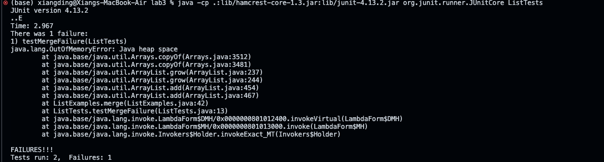
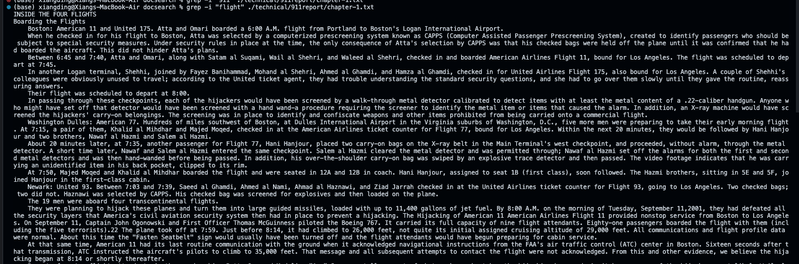
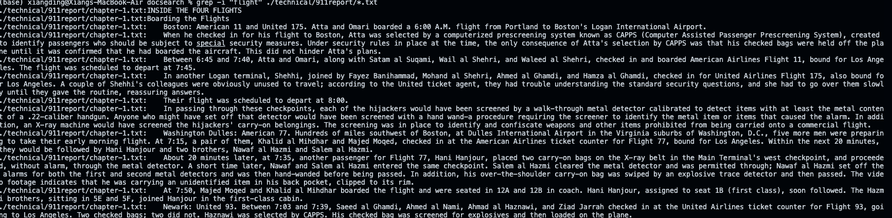
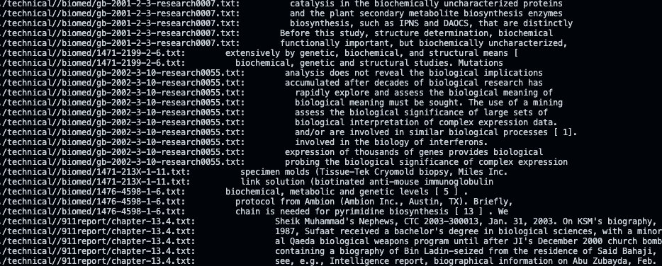
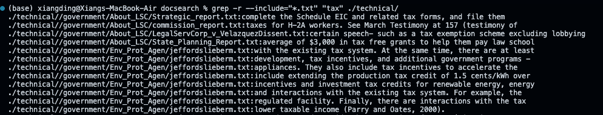
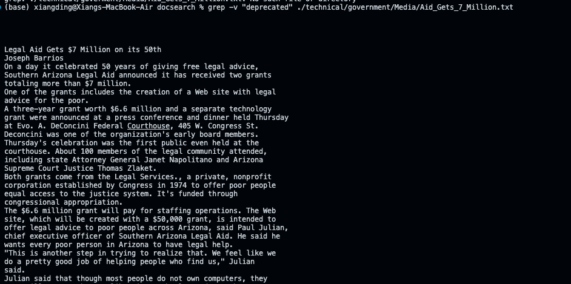
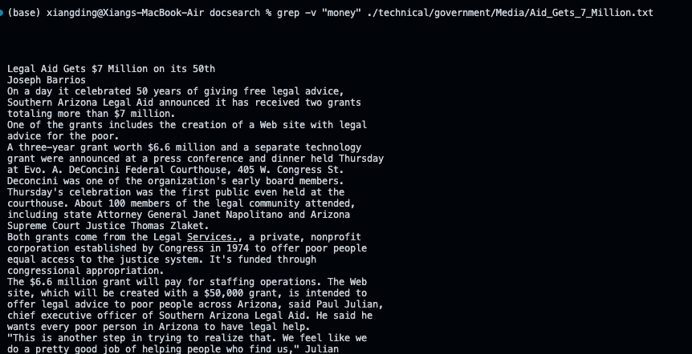
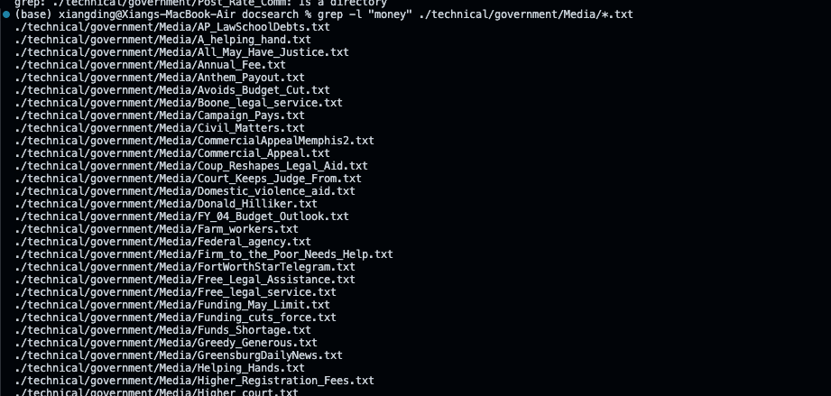
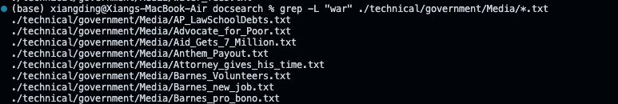

### failure-inducing input

```

import static org.junit.Assert.*;
import java.util.Arrays;
import java.util.List;
import org.junit.*;


public class ListTests {
    @Test
    public void testMergeFailure() {
        List<String> list1 = Arrays.asList("a", "c");
        List<String> list2 = Arrays.asList("b", "d", "e");
        List<String> expected = Arrays.asList("a", "b", "c", "d", "e");
        List<String> result = ListExamples.merge(list1, list2);
        assertEquals(expected, result);
    }
}

```
### The symptom


### Input That Doesn't Induce a Failure

```
import static org.junit.Assert.*;
import java.util.Arrays;
import java.util.List;
import org.junit.*;

public class ListTests {
 @Test
    public void testMergeSuccess() {
        List<String> list1 = Arrays.asList("a", "b", "c");
        List<String> list2 = Arrays.asList();
        List<String> expected = Arrays.asList("a", "b", "c");
        List<String> result = ListExamples.merge(list1, list2);
        assertEquals(expected, result); 
    }

}


```


# Before fixing
```
  static List<String> merge(List<String> list1, List<String> list2) {
    List<String> result = new ArrayList<>();
    int index1 = 0, index2 = 0;
    while(index1 < list1.size() && index2 < list2.size()) {
      if(list1.get(index1).compareTo(list2.get(index2)) < 0) {
        result.add(list1.get(index1));
        index1 += 1;
      }
      else {
        result.add(list2.get(index2));
        index2 += 1;
      }
    }
    while(index1 < list1.size()) {
      result.add(list1.get(index1));
      index1 += 1;
    }
    while(index2 < list2.size()) {
      result.add(list2.get(index2));
      index1 += 1;
    }
    return result;
  }


```


### After fixing the bug
```

  static List<String> merge(List<String> list1, List<String> list2) {
    List<String> result = new ArrayList<>();
    int index1 = 0, index2 = 0;
    while(index1 < list1.size() && index2 < list2.size()) {
      if(list1.get(index1).compareTo(list2.get(index2)) < 0) {
        result.add(list1.get(index1));
        index1 += 1;
      }
      else {
        result.add(list2.get(index2));
        index2 += 1;
      }
    }
    while(index1 < list1.size()) {
      result.add(list1.get(index1));
      index1 += 1;
    }
    while(index2 < list2.size()) {
      result.add(list2.get(index2));
      index2 += 1;
    }
    return result;
  }


```

### Why fixing the error?

The fix corrects the logic in the merge method, ensuring that index2 is incremented when elements from list2 are being added to the result list. 
This corrects the increment of the loop, preventing an infinite loop and ensuring that all elements from both input lists are correctly merged in sorted order.


### Researching Commands

For this task, I will focus on the `grep` command, which is used to search text or search the given file for lines containing a match to the provided strings or words. It stands for "Global Regular Expression Print". `grep` is incredibly powerful and versatile, offering a wide range of options to refine searches, match complex patterns, and manipulate output.

### 1. Option: `-i` (Ignore Case)
Source: https://www.geeksforgeeks.org/grep-command-in-unixlinux/

The `-i` option tells `grep` to ignore case distinctions in both the pattern and the input files.

#### Example 1: Searching for a string in a file, ignoring case

```
grep -i "flight" ./technical/911report/chapter-1.txt
```

This command searches for the word "flight" in the `chapter-1.txt` file inside the `./technical/911report` directory, ignoring whether "flight" is in uppercase, lowercase, or mixed case. It's useful for finding content without worrying about case sensitivity.

#### Example 2: Searching in multiple files, ignoring case

```
grep -i "flight" ./technical/911report/*.txt
```

This command looks for the word "flight" in all `.txt` files within the `./technical/911reports` directory, ignoring case distinctions. It helps in scanning log files for errors without case sensitivity concerns.

### 2. Option: `-r` or `--recursive`
Source: https://man7.org/linux/man-pages/man1/grep.1.html
The `-r` option allows `grep` to search recursively through directories, checking all files in the directory and its subdirectories.

#### Example 1: Recursively searching for a string in all files

```
grep -r "bio" ./technical/
```

This command searches for the word "bio" in all files within the `./technical/` directory and its subdirectories. It's particularly useful for searching through a hierarchy of files.

#### Example 2: Recursively searching with a specific file pattern

```
grep -r --include="*.txt" "tax" ./technical/
```

This command searches for the word "tax" in all Python files (`*.txt`) recursively in the `./technical` directory. It helps in finding tax statements across a govement docs.

### 3. Option: `-v` (Invert Match)
Source: https://man7.org/linux/man-pages/man1/grep.1.html
The `-v` option inverts the match, showing only the lines that do not match the given pattern.

#### Example 1: Finding lines that do not contain a specific string

```
grep -v "deprecated" ./technical/government/Media/Aid_Gets_7_Million.txt
```

This command shows all lines in the `Aid_Gets_7_Million.txt` file that do not contain the word "deprecated". It's useful for filtering out unwanted patterns.

#### Example 2: Excluding specific logs

```
grep -v "money" ./technical/government/Media/Aid_Gets_7_Million.txt
```

This command filters out lines containing "money" from the `Aid_Gets_7_Million.txt` file, useful for focusing on higher-severity messages.

### 4. Option: `-l` (Files with Matches)
source: https://man7.org/linux/man-pages/man1/grep.1.html
The `-l` option tells `grep` to only print the names of files with matching lines, once for each file.

#### Example 1: Listing files containing a specific string

```
grep -l "money" ./technical/government/Media/*.txt
```

This command lists JavaScript files in `./technical/government/Media` that contain "money" comments. It's handy for finding files that need attention.

#### Example 2: Listing files without a specific pattern

```
grep -L "war" ./technical/government/Media/*.txt
```

This command lists `.txt` files in `./technical/government/Medias` that do not contain the word "war". It can be used to quickly identify reports indicating failures or missing data.

